# תרשים זרימה — מנוע מסקנת גורל החול
## Conclusion Engine — Flow Diagram
### מבוסס על: كشف الأسرار (276 עמודים, 12 פרקים)

---

## תרשים ראשי — צינור הנתונים השלם

```mermaid
flowchart TD

  %% ═══════════════════════════════
  %% שלב 0: קלט
  %% ═══════════════════════════════
  subgraph IN ["שלב 0 · קלט"]
    Q["שאלת הלקוח\n(טקסט חופשי)"]
    CTX["הקשר לקוח\nשם · גיל · מין\nמצב משפחתי"]
    MOTHERS["4 אמהות\nידני / אקראי"]
  end

  %% ═══════════════════════════════
  %% שלב 1: סיווג השאלה
  %% ═══════════════════════════════
  Q & CTX --> QCLASSIFY["🔍 מסווג הנושא\nquestion-classifier.js\n──────────────────\n12 פרקי הספר → נושא + תת-נושא\n+ רשימת בתים רלוונטיים"]

  %% ═══════════════════════════════
  %% שלב 2: מחולל הלוח
  %% ═══════════════════════════════
  MOTHERS --> BOARDGEN

  subgraph BOARDGEN ["שלב 2 · מחולל הלוח — raml-board-generator.js"]
    direction TB
    AM["4 אמהות\nב1–ב4"]
    --> DAUGHTERS["4 בנות\nב5–ב8\n(שחלוף שורות)"]
    --> GRANDDAUGHTERS["4 מתולדות\nב9–ב12\n(שחלוף בנות)"]
    --> WITNESSES["ב13 עד-ימין\nב14 עד-שמאל\n(חיבור שדות)"]
    --> JUDGE["ב15 שופט\nב16 עאקבה\n(חיבור עדים)"]
    JUDGE --> DHAMIR["דאמיר — הבית הנסתר\n(ספירת נקודות × mod 12)"]
  end

  %% ═══════════════════════════════
  %% שלב 3: בדיקת תקינות
  %% ═══════════════════════════════
  BOARDGEN --> VALID{ב15 זוגי?\nאין ענן/שחר\nבאמהות?}
  VALID -->|"❌ פסול"| INVALID["הלוח פסול\n(נפל בעת אסורה\nאו צורות פוסלות)"]
  VALID -->|"✅ תקין"| FIGANA

  %% ═══════════════════════════════
  %% שלב 4: ניתוח צורות
  %% ═══════════════════════════════
  subgraph FIGANA ["שלב 4 · ניתוח צורות — לכל אחד מ-16 הבתים"]
    direction LR
    F1["זהות הצורה\n(מתוך 16 צורות)"]
    F2["איכות\nסעד / נחס"]
    F3["כיוון\nדאח׳ל / ח׳ארג׳"]
    F4["יציבות\nת׳אבת / מנקלב / מג׳סד"]
    F5["יסוד\nאש / אוויר / מים / אדמה"]
    F6["כוכב\nזחל / מושתרי / מריח\nשמש / זהרה / עטארד / קמר"]
    F7["מין\nזכר / נקבה / ח׳נת׳א"]
    F8["דיבור\nנאטק / סאמת"]
    F9["זמן\nהוֶה / עתיד / עבר"]
    F10["מעמד\nטאלב / מטלוב"]
  end

  BOARDGEN --> FIGANA
  FIGANA --> ROUTING

  %% ═══════════════════════════════
  %% שלב 5: ניתוב לפי נושא
  %% ═══════════════════════════════
  QCLASSIFY --> ROUTING

  subgraph ROUTING ["שלב 5 · ניתוב לפי נושא"]
    direction TB
    RT{פרק?}
    RT -->|"1: גיל/עצמי"| CH1["ב1 · ב3 · ב5 · ב7\nצורת-ב1 = שלב חיים"]
    RT -->|"2: אבידה/נסתר"| CH2["ב2 · ב4 · ב7 · ב8\nדאח׳ל = קיים; ח׳ארג׳ = אבד"]
    RT -->|"3: מחלה"| CH3["ב1 · ב6 · ב8\nסעד-ב6 = החלמה\nנחס-ב8 = סכנה"]
    RT -->|"4: נישואין"| CH4["ב1 · ב7 · ב5 · ב4\nאתסאל ב1↔ב7 = נישואין"]
    RT -->|"5: הריון/ילדים"| CH5["ב1 · ב5 · ב4\nצורת-ב5 = מין העובר"]
    RT -->|"6: מסחר/קנייה"| CH6["ב1 · ב2 · ב7\nדאח׳ל-ב2 = רווח"]
    RT -->|"7: דין/משפט"| CH7["ב1 · ב7 · ב10\nמי חזק יותר?"]
    RT -->|"8: נעדר/בורח"| CH8["ב1 · ב3 · ב5 · ב7 · ב9\nיסוד = כיוון התנועה"]
    RT -->|"9: נסיעה"| CH9["ב1 · ב2 · ב3 · ב7 · ב9\nאניה: מעבר יסוד→יסוד"]
    RT -->|"10: שלטון"| CH10["ב1 · ב7 · ב10 · ב11\nב10 + 4 יתדות = משך"]
    RT -->|"11: חברים/תקוות"| CH11["ב1 · ב4 · ב5 · ב11\nסעד-דאח׳ל = קבוע"]
    RT -->|"12: אויבים/אסירים"| CH12["ב1 · ב7 · ב12 · ב13 · ב16\nב13: ח׳ארג׳=ישתחרר\nב16+ב12: טבלת-גורל"]
  end

  %% ═══════════════════════════════
  %% שלב 6: ניתוח ראשי
  %% ═══════════════════════════════
  ROUTING --> MAINANA

  subgraph MAINANA ["שלב 6 · ניתוח ראשי — hawi-interpreter.js"]
    direction TB

    A_Q["מצב השואל\nצורת-ב1: סעד/נחס · דאח׳ל/ח׳ארג׳\n→ מי הוא + מה מצבו"]
    A_TOPIC["הבית הנושאי\nמצב הצורה בבית הרלוונטי\n→ מהות העניין"]
    A_REL["יחס ב1 ↔ בית-נושא\nאתסאל (חיבור) / אנפסאל (ניתוק)\n→ האם יתקיים?"]
    A_PLANET["זיהוי הצדדים לפי כוכבים\nזחל=מבוגר/כהה · קמר=נשים\nמושתרי=עשיר · מריח=חייל"]

    A_Q --> A_TOPIC --> A_REL --> A_PLANET
  end

  %% ═══════════════════════════════
  %% שלב 7: ניתוח עדים ושופט
  %% ═══════════════════════════════
  MAINANA --> WITNESS

  subgraph WITNESS ["שלב 7 · עדים ושופט — raml-interpreter.js"]
    direction LR
    W13["ב13 עד-ימין\n= תקציר חצי-ראשון\n(מי יזכה?)"]
    W14["ב14 עד-שמאל\n= תקציר חצי-שני\n(מה העתיד?)"]
    W15["ב15 שופט\n= פסיקה כללית\nסעד = טוב · נחס = רע"]
    W16["ב16 עאקבה\n= עתיד סופי\n(מה יהיה בסוף?)"]

    W13 & W14 --> W15 --> W16
  end

  %% ═══════════════════════════════
  %% שלב 8: שכבות נוספות
  %% ═══════════════════════════════
  WITNESS --> LAYERS

  subgraph LAYERS ["שלב 8 · שכבות ניתוח נוספות"]
    direction TB
    L1["דאמיר — הבית הנסתר\nהגורם הנסתר המשפיע על העניין"]
    L2["מזאג׳ — איזון יסודות\nספירת אש/אוויר/מים/אדמה בלוח\n→ אופי הסיטואציה"]
    L3["אבחון רוחני\nגילוי עין-הרע / כישוף / שֵד\n(לפי צירופי צורות מיוחדים)"]
    L4["עיתוי — מתי?\nשיטת-הספירה (mod 4/7/12)\nירחי / שבועות / ימים"]
    L5["כיוון — לאן?\nיסוד הצורה בב9/ב3\n→ מזרח/מערב/צפון/דרום"]

    L1 --- L2 --- L3 --- L4 --- L5
  end

  %% ═══════════════════════════════
  %% שלב 9: שיטות מיוחדות
  %% ═══════════════════════════════
  LAYERS --> SPECIAL

  subgraph SPECIAL ["שלב 9 · שיטות מיוחדות (לפי נושא)"]
    direction LR
    SP1["שיטת 4-יתדות\n(ב1+ב4+ב7+ב10 → אמהות חדשות)\n→ לנושאי שלטון/ממון"]
    SP2["שיטת ב1+בית-X → צורה\nח׳ארג׳=כן / דאח׳ל=לאו\n→ לאסירים, אבידות"]
    SP3["ספירת נקודות\nנקט×X mod 4\nנחס/מהיר/לא/מאוחר"]
    SP4["שיטת האמהות מ-ב13+14+15\n(מסורת אל-זנאתי)\n→ לנושאי נסיעה/בריחה"]
  end

  %% ═══════════════════════════════
  %% שלב 10: כתיבת המסקנה
  %% ═══════════════════════════════
  SPECIAL --> CW

  subgraph CW ["שלב 10 · כתיבת המסקנה — goral-conclusion-writer.js"]
    direction TB
    CW1["1 · מבוא\nזיהוי השואל + עניינו"]
    CW2["2 · מצב הלוח\nאיזון סעד/נחס + כוכב שולט"]
    CW3["3 · הפסיקה הראשית\nתשובה לשאלה: כן/לאו + פירוט"]
    CW4["4 · הבית הנסתר (דאמיר)\nהגורם הנסתר + השפעתו"]
    CW5["5 · עתיד ועיתוי\nמה יהיה + מתי"]
    CW6["6 · אזהרות והמלצות\nמה לעשות / מה להיזהר"]

    CW1 --> CW2 --> CW3 --> CW4 --> CW5 --> CW6
  end

  CW --> OUT[("📜 מסקנה\nנרטיב עברי שלם")]
```



---

## טבלה: בתים רלוונטיים לפי פרק

| פרק | נושא | ב-ראשי | ב-שואל | ב-יריב | ב-עוזר | פסיקה מ |
|-----|------|--------|--------|--------|--------|---------|
| 1 | גיל / מצב עצמי | ב1 | ב1 | — | ב3, ב5 | צורת-ב1 |
| 2 | אבידה / נסתר | ב2, ב8 | ב1 | ב7 | ב4 | דאח׳ל/ח׳ארג׳ |
| 3 | מחלה | ב6 | ב1 | ב8 | ב7 | סעד-ב6 |
| 4 | נישואין/אישה | ב7 | ב1 | — | ב5, ב4 | אתסאל ב1↔ב7 |
| 5 | הריון / ילדים | ב5 | ב1 | — | ב4 | צורת-ב5 |
| 6 | מסחר / קנייה | ב2 | ב1 | ב7 | ב3 | דאח׳ל-ב2 |
| 7 | דין / משפט | ב7 | ב1 | ב7 | ב10 | חוזק ב1 vs ב7 |
| 8 | נעדר / בורח | ב9, ב3 | ב1 | ב7 | ב5 | יסוד → כיוון |
| 9 | נסיעה | ב9 | ב1 | ב7 | ב3, ב2 | ב9 + מעבר-יסוד |
| 10 | שלטון / מלכות | ב10 | ב1 | ב7 | ב11 | ב10 + 4-יתדות |
| 11 | חברים / תקוות | ב11 | ב1 | — | ב4, ב5 | סעד-דאח׳ל-ב11 |
| 12 | אויבים / אסירים | ב12 | ב1 | ב7 | ב13, ב16 | ב16+ב12 טבלה |

---

## טבלה: פרמטרי ניתוח הצורה

| פרמטר | ערכים | משמעות |
|-------|-------|--------|
| **סעד / נחס** | סעד (6 צורות) / נחס (5) / ממוזג (5) | פסיקה חיובית / שלילית / מעורבת |
| **דאח׳ל / ח׳ארג׳** | דאח׳ל (פנימי) / ח׳ארג׳ (חיצוני) | מצוי/בטוח vs. יוצא/בחוץ |
| **ת׳אבת / מנקלב / מג׳סד** | קבוע / מתהפך / כפול | קביעות / שינוי / כפילות |
| **יסוד** | אש / אוויר / מים / אדמה | כיוון, אופי, עיתוי |
| **כוכב** | זחל · מושתרי · מריח · שמש · זהרה · עטארד · קמר | זיהוי הצדדים, תיאור האנשים |
| **מין** | זכר / נקבה / ח׳נת׳א | מגדר העניין / הצד |
| **נאטק / סאמת** | מדבר / שותק | אם יש תגובה / התרה |
| **טאלב / מטלוב** | מבקש / מבוקש | מי יוזם, מי מושך |
| **הוֶה / עתיד / עבר** | יתד / נוטה / נופל | מועד ביחס להווה |

---

## טבלה: שיטות ספציפיות מהספר (כשף אל-אסראר)

| שיטה | תנאי | ח׳ארג׳ = | דאח׳ל = |
|------|------|---------|---------|
| ב1+ב13 | שחרור אסיר | ישתחרר | יתעכב |
| ב1+ב5 (נזהת-עקול) | מסגון | יצא | ישאר |
| ב16+ב12 | גורל האסיר | לפי טבלה | לפי טבלה |
| ב10+ב11 (מלתקט) | פרנסה | — | סעד+ב1+אי-זוגי = יגיע |
| ב5+ב11×ב1 | תקווה/בקשה | סעד=יתאחר; נחס=ויתר | סעד=יתקיים; נחס=בקושי |
| ב1+ב7+ב10+ב12→אמהות | הפסיקה על האויב | — | סעדות = זה הדין |
| נקט-ב5+ב6 | שחרור (נזהת-עקול) | — | זוגי=יתאחר; אי-זוגי=מהר |
| ב13 חוזר בב3/5/9+ב10-סעד | שחרור (מלתקט) | יצא מרצונו | — |
| ב2+ב12+ב3, ב4+ב1→צורה | עאקבת-מסגון | — | נחס=רעה; סעד=טובה |

---

## מפת קבצים — מנועי המסקנה

```
goral-hachol/
├── engine/
│   ├── raml-board-generator.js       ← שלב 2: יצירת הלוח
│   ├── raml-interpreter.js           ← שלב 7: עדים + שופט + דאמיר
│   ├── hawi-interpreter.js           ← שלב 6: ניתוח נושאי
│   └── goral-conclusion-writer.js    ← שלב 10: כתיבת המסקנה
│
└── [חסר — לפיתוח]:
    ├── question-classifier.js         ← שלב 1: סיווג השאלה (12 פרקים)
    ├── figure-analyzer.js             ← שלב 4: פרמטרי כל צורה
    ├── special-methods.js             ← שלב 9: שיטות מיוחדות (כשף+נזהת+מלתקט)
    └── spiritual-diagnostics.js       ← שלב 8: אבחון עין-הרע/כישוף
```

---

## מקורות הידע (לפי שלב)

| שלב | מקור ראשי |
|-----|-----------|
| יצירת הלוח | כשף אל-אסראר, ספר בלוג אל-אמל |
| ניתוח פרמטרי הצורה | כשף אל-אסראר שערים 1-2 (עמ' 60–130) |
| ניתוח עדים/שופט | חאוי אל-עג'איב + כשף אל-אסראר |
| ניתוח נושאי (פ1-12) | כשף אל-אסראר פרקים 1-12 (עמ' 180–276) |
| שיטות מיוחדות | נזהת אל-עקול + אל-מלתקט + אל-זנאתי |
| אבחון רוחני | חאוי אל-עג'איב (קובצי data/sources/hawi) |
